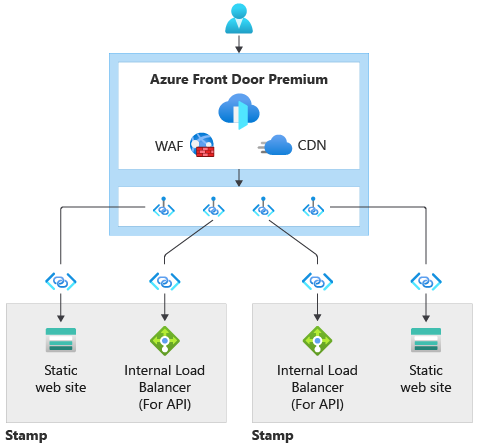
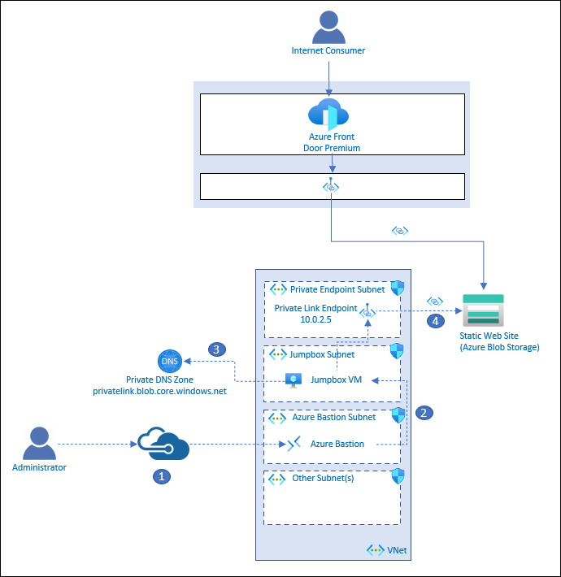

# Ingress with Azure Front Door Sample

The goal of this sample is to illustrate global routing with Azure Front Door. The sample uses Azure Storage Accounts with static html files to simulate workloads running in multiple regions.

## Deployments

You can either deploy the Standard or Premium version of Azure Front Door.

### Azure Front Door Standard


The Azure Front Door Standard deployment illustrates global routing without securing the workloads from a network perspective. The following resources are deployed:

- Azure Storage Accounts (specified by the storageAccountWebsiteLocations array parameter)
- Azure Front Door Standard

The storage accounts will be added as origins to Front Door.

Once the deployment is complete, you will need to add an "index.html" file to the web blob container in each Storage Account. You provide the object id of a Service Principal as a parameter (principalId). The Service Principal is given an Azure Role Based Access Control (RBAC) role assignment of "Storage Blob Data Contributor". You can use this Service Principal to copy index.html files to each Storage Account. You will find the commands in the instructions below.

### Azure Front Door Premium



If you choose to deploy Azure Front Door premium tier, private endpoint connection requests will be created from Azure Front Door Premium to each storage account. Further, the storage accounts will be configured to only be accessible from selected virtual networks and IP addresses, with no virtual networks specified. This effectively locks down the storage accounts.

All requests will flow through Azure Front Door. Azure Front Door will connect to the Azure Storage Accounts through the Microsoft Backbone network via Private Link.

### Virtual Network for Azure Front Door Premium



Because the storage accounts are locked down, the sample also allows you to deploy an Azure Virtual Network with Azure Bastion and a Jumpbox Virtual Machine. Private endpoint connections are made to the storage account in the Virtual Network. This will allow you to interact with the Storage Accounts from the Jumpbox.

Again, all requests will flow through Azure Front Door and Azure Front Door will connect to the Azure Storage Accounts through the Microsoft Backbone network via Private Link.

This deployment illustrates how an administrator could connect to a jumpbox virtual machine via Azure Bastion to perform any (emergency) administrative tasks. The following resources are deployed:

- Azure Virtual Network with 5 subnets:
  - default
  - FirewallSubnet
  - PrivateEndpointsSubnet
  - JumpboxSubnet
  - AzureBastionSubnet
- Jumpbox Virtual Machine
- Azure Bastion
- Private endpoints to each storage account
- Private DNS Zone - configured with A records for the private endpoint URLs to the storage accounts

The following describes the administrative flow:

1. An administrator connects to Azure Bastion that is deployed in the Virtual Network.
2. Azure Bastion provides SSH connectivity to the jumpbox virtual machine.
3. The administrator on the jumpbox tries to access the storage account via the Azure CLI. The jumpbox queries DNS for the public Azure Blob Storage Account endpoint: storageaccountname.blob.core.windows.net. Private DNS ultimately resolves to storageaccountname.privatelink.blob.core.windows.net, returning the private IP address of the private link endpoint which is 10.0.2.5 in this example.
4. A private connection to the storage account is established through the private link endpoint.

## Getting Started

> [!IMPORTANT]
> This sample assumes that there are no Azure Policies blocking aspects of the deployment. For example, many companies have a policy set to deny Azure Storage Accounts with public access. This sample uses publicly accessible Storage Accounts.

There are a couple of prerequisites you will need:

- You will need to clone the repository
- A service principal. You will need the service principal app id, object id and password
- A SSH key pair

### Clone or download this repository

From your shell or command line:

```bash
git clone https://github.com/RobBagby/network-secure-ingress-sample
cd network-secure-ingress-sample
```

### Creating a service principal

You must pass the object id of a service principal as a parameter. This SP will be given Storage Blob Data Contributor Role Assignment at the Resource Group level. This SP can be used to connect to the storage accounts.

To create a service principal, follow the guidance on [creating a password-based authenticated sp here](https://docs.microsoft.com/cli/azure/create-an-azure-service-principal-azure-cli#password-based-authentication). The following is an example:

```bash
az ad sp create-for-rbac --scopes /subscriptions/mySubscriptionID \
  --name myServicePrincipalName \
  --role rolename

az ad sp create-for-rbac --scopes "/subscriptions/mySubscriptionID" --role "Contributor" --name mySpName
{
  "appId": "appIdGuid",
  "displayName": "mySpName",
  "name": "guid",
  "password": "password",
  "tenant": "myTenantId"
}
```

You will also need the object id of the SP. You can get that with this Azure CLI call

```bash
az ad sp show --id <appIdGuid from above> --query id
```

### Creating SSH key pair

There are a variety of ways to create the SSH pey pair:

- [Generate and store SSH keys in the Azure portal](https://docs.microsoft.com/azure/virtual-machines/ssh-keys-portal)
- [Create and manage SSH keys locally](https://docs.microsoft.com/azure/virtual-machines/linux/create-ssh-keys-detailed)
- [Create and manage SSH Keys with the Azure CLI](https://docs.microsoft.com/azure/virtual-machines/ssh-keys-azure-cli)

## Deploying

### Deploying Azure Front Door Standard

Use the following command to deploy the Azure Front Door Standard deployment

```bash
az deployment sub create --template-file deployRgFrontDoorAndWeb.bicep \
  --location centralus \
  -p frontDoorSkuName=Standard_AzureFrontDoor assetPrefix=uniqueprefixname
```

### Deploying Azure Front Door Premium With Private Endpoints

Use the following command to deploy the Azure Front Door Premium deployment

```bash
az deployment sub create --template-file deployRgFrontDoorAndWeb.bicep \
  --location centralus \
  -p frontDoorSkuName=Premium_AzureFrontDoor assetPrefix=uniqueprefixname
```

### Deploying the VNet for the Front Door Premium deployment

You will need to update the following parameters in parameters.json:

- jumpboxPublicSshKey - This is the public SSH key you created earlier
- assetPrefix - This is used as the basis for the names of every asset deployed. For example if the assetPrefix is 'testworkload', the Azure Resource Group name will be 'testworkload-rg'. This assetPrefix MUST match the assetPrefix used in the Front Door Premium deployment
- storageAccountWebsiteLocations - This is an array of valid Azure locations where Storage Accounts will be created.
- vmadmin - The name of the admin account to create for the Jumpbox Virtual Machine.
- principalId - The object id of the Service Principal created above. Do not use the appId.

The following is an example of storageAccountWebsiteLocations:

```bash
"storageAccountWebsiteLocations": {
    "value": [
    "eastus",
    "westus3"
    ]
},
```

Use the following command to deploy the Virtual Network deployment

```bash
az deployment group create \
  --template-file deployVnet.bicep \
  --resource-group resourceGroupName \
  --parameters @parameters.json 
```

Note: The resourceGroupName should be the name of the resource group deployed in the Front Door Premium deployment.
Note: You MUST make sure that the assetPrefix matches the assetPrefix used in the Front Door Premium deployment.

## Adding index.html files to the websites

This repository has 2 index.html files you can use. One is for West US and the other for East US.

Use the following command to log into the Azure CLI as the Service Principal:

```bash
read -sp "Password for Service Principal: " SP_SECRET && echo && read -sp "appId for Service Principal: " SP_APPID && echo && read -sp "Tenant id for Service Principal: " SP_TENANT && echo && az login --service-principal -u $SP_APPID -p $SP_SECRET --tenant $SP_TENANT
```

Use the following commands to copy the sample web pages to your storage accounts:

```bash
az storage blob copy start \
  --account-name nameOfWestStorageAccount \
  --destination-blob index.html \
  --auth-mode login \
  --destination-container web \
  --source-uri https://raw.githubusercontent.com/RobBagby/network-secure-ingress-sample/main/sample-websites/west/index.html

az storage blob copy start \
  --account-name nameOfEastStorageAccount \
  --destination-blob index.html \
  --auth-mode login \
  --destination-container web \
  --source-uri https://raw.githubusercontent.com/RobBagby/network-secure-ingress-sample/main/sample-websites/east/index.html
```

## Clean up resources

```bash
az deployment group create -f ./main.bicep -g my-rg --mode Complete
```

```bash
az group delete --name <nameOfResourceGroup>
```
